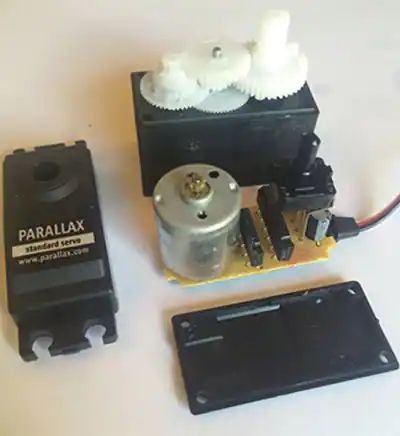

# Servo instructions

En servomotor er en motor, hvis aksel drejer til en bestemt position baseret på et styresignal. De bruges typisk til at styre fjernstyrede fly ved at justere vingeklapperne, flyveposition for droner, styreventiler, der bruges til flowkontrol eller kontinuerlig kørsel af hjul til robotter. De kan bruges til at placere eller justere næsten alt, hvad du kan tænke på. De består af et plastikhus, som indeholder en jævnstrømsmotor, et styrekredsløb og et par gear til moment (se figur 1).

<figure>
  
  <figcaption>Fig.1 - Servo med 180 graders bevægelse</figcaption>
</figure>

# Servoens funktions måde
Styringen af servomotorens akselposition kommer fra brug af et pulsbreddemodulationssignal (PWM) til at dreje akslen med uret eller mod uret, afhængigt af signalets pulsbredde. Typisk vil en pulsbredde på 1 ms rotere akslen med uret, og en 2 ms puls vil rotere akslen mod uret. For at placere skaftet halvvejs eller i midten fungerer en 1,5 ms puls typisk. Du skal bruge 20 ms mellem hver puls. Figur 2 nedenfor viser timingen for hver position.

<figure>
  
  <figcaption>Fig.2 - PWM Timing for forskellige akselpositioner</figcaption>
</figure>

# Servoens forbindelse
<figure>
  
  <figcaption>Figure 3: The wiring connections as shown in Parallax’s datasheet.</figcaption>
</figure>

# Vælg servo til dit projekt
Bestem først om du har brug for begrænset (maks. 180 grader) eller kontinuerlig rotation. Du bør også bemærke mængden af drejningsmoment, akslen skal have til din anvendelse, sammen med rotationshastigheden, som er vurderet i RPM (omdrejninger pr. minut).

Hvis du bygger et objekt i bevægelse, f.eks. en robot, bruges servoer med kontinuerlig rotation typisk til at drive hjulene. På den anden side kan servoer med begrænset rotation bruges til applikationer såsom placering af en modelflyvingeklap til flyvekontrol, en vandventil, en kontakt eller til at hjælpe et håndgreb, der bruges til en robotarm.

# Test af 
```C++
/* Sweep
 by BARRAGAN <http://barraganstudio.com>
 This example code is in the public domain.
 modified 8 Nov 2013
 by Scott Fitzgerald
 http://www.arduino.cc/en/Tutorial/Sweep
*/

#include <Servo.h>

Servo myservo;                                                // create servo object to control a servo

// twelve servo objects can be created on most boards
int pos = 0;                                                  // variable to store the servo position

void setup()    {
    myservo.attach(9);                                      // attaches the servo on pin 9 to the servo object
}

void loop()   {
  for (pos = 0; pos <= 180; pos += 1)                       // goes from 0 degrees to 180 degrees
                                                            // in steps of 1 degree
  {                                                                             
    myservo.write(pos);                                     // tell servo to go to position in variable 'pos'
    delay(15);                                              // waits 15ms for the servo to reach the position
  }

  for (pos = 180; pos >= 0; pos -= 1)                       // goes from 180 degrees to 0 degrees 
  {            
    myservo.write(pos);                                     // tell servo to go to position in variable 'pos'
    delay(15);                                              // waits 15ms for the servo to reach the position
  }
}
```
